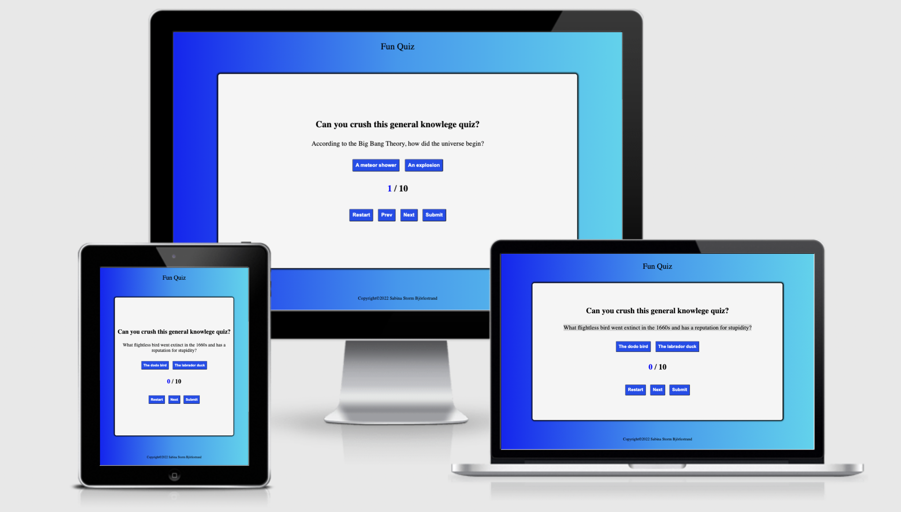

# QUIZ
For my Milestone Project 2 on Code Institute's Diploma in Software Developement course I have created a quiz.

For link to the website click [Here](https://sabinastorm.github.io/quiz/)

Design has been focused to Responsive for big screen and tablets.

## Who is this website for?

This is a quiz about general knowledge just for fun and is for everyone of all ages.

## The owner

The owner of this site is Sabina Storm Björlestrand

## What does it do?

The quiz has ten questions about general knowlege with two answer options for the user to choose from. Each correct answer gives one point.

## User experience

### User stories

#### From customers perspective

- As a user I want to navigate clearly and logically through the website

- As a user I want to know what to do next in the quiz
- As a user I want to have options
- As a user I want to see my score
- As a user I want to know the correct answer
- As a user I want to be able to restart the game

#### Customers perspective fulfilment

- The first question is visible at start and also the option buttons
- The next and previuos buttons navigate
- The website has a section with the users score
- For correct answer the user receives one point
- The restart button restarts the game

## UX 5 Planes
### Strategy Plane
The website is created for a fun quick and easy quiz. Page is created in a very simple, yet effective way to serve it's purpose. The information is clear and calls to action.

### Scope Plane
Features included in this Project

- One page 
- game area
- buttons for answer options 
- buttons for navigation
- user score/total score

### Structure plane
Website consists of one page with the specific purpouse. The page is laid out logicaly, so the user can easily find their way around it.

- Header
  Tells it's a fun quiz

- Game area
  Includes question content, buttons to answer and buttons to navigate 

- Footer 
  Includes the copyright

### Skeleton Plane
Design was focused towards big screen and tablet mainly.

### Surface Plane
- Colors
For body
#0f26f6,#1399f2,#14d5ef
For user score
rgb(0, 4, 255)
For buttons
#4313f2
#4313f2

- Typography

Throughout the website one font family is used

Source Serif 4

Fonts are obtained from Google Fonts.

## Features
### Exsisting Features
created in HTML5, CSS3 and JavaScript
- Body 
- Game area
- Game features

### Feature for future implementation
- Responsivenes for small mobile devices
- An information text about the correct answer to show after the user has answered to make the game more educational.
- A score traker so the user can compare their score with other users

## Technologies used

- [HTML5](https://en.wikipedia.org/wiki/HTML) for markup
- [CSS3](https://en.wikipedia.org/wiki/CSS) for style
- [Google Fonts](https://fonts.google.com/) for fonts
- [Javascript](https://sv.wikipedia.org/wiki/Javascript) for script
- [Git](https://gitpod.io/) for version control
- [GitHub](https://github.com/) for keeping the files, documents and deployment of the website

## Resources

- [Code Institute](https://learn.codeinstitute.net/) course materials
- [Code Institute](https://learn.codeinstitute.net/) Slack Community
- [Stackoverflow](https://stackoverflow.com/)
- [W3schools](https://www.w3schools.com/)
- [Am I Responsive](http://ami.responsivedesign.is/) for a responisve image in Read Me
- [5pence](https://5pence.net/) for markdown
- [Codingninjas](https://www.codingninjas.com/blog/2020/11/03/how-to-create-a-quiz-in-javascript/) for javascript and CSS code 

## Testing

### Browser testing

Website has been tested in Google chrome and Safari

Website has been testen on Apple Iphone

Both test confirmed that the website works great

All the functions and responsiveness do not work on Apple iPhone

### Validators

The website has been through W3C Jigsaw validation with no errors.

Website has been through W3C HTML Validator and there is no error to report

### Local testing

Testing of all the buttons shows no errors

### Responsiveness

I used Google Chrome Dev Tools to check the responsiveness of website. The website is not compatible with Apple iPhone for now.

## Version control

### Git and Github

I used GitPod as a local repository and GitHub as a remote repository. The process of version control was:

- First i created a new repository in GitHub
- Then opened that repository in GitPod and started coding
- In GitPod i created my files and folders
- I then saved my work and pushed it to GitHub repository to keep it safe

Saving, commiting and pushing it to remote repository in terminal:
- git add . 
- git commit -m "Commit message" 
- git push to update work to GitHub

## Deployment

To deploy the website, I followed the below steps on [GitHub](https://github.com/).

- Go to "Settings" on the repository
- On "Source" of "GitHub Pages", select "master for Branch and click save
- Refresh page
- The website is now published on GitHub Pages and the link is provided on on the same section